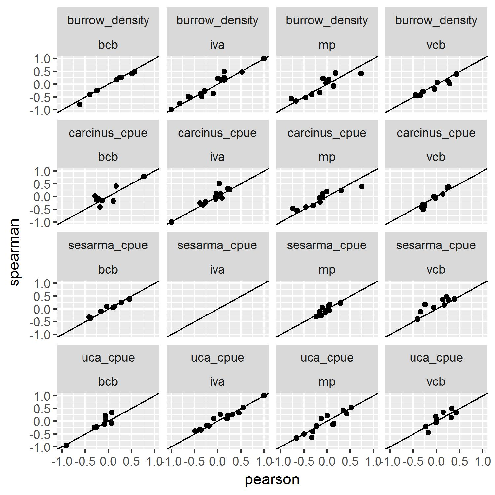

---
output:
  word_document: default
  html_document: default
---
# Editor

- **Comment:** Figure 6. Please use different symbol shapes (circle, triangle..) for different groups of data. Some readers do not have access to color printers or are color-blind.
    - *response:* Figure 6 now has triangles and dots for the separate groups

# Reviewer 1

**Comment:** For the correlation study shown in Fig 4, data were pooled across all four marshes to make comparisons between the four habitats and crab indicators (of population size). Yet, the 2-way ANOVA results shown in Table 2 indicate significant differences and interactions for all three crab species with location (i.e., marsh) and habitat. Is pooling justified? More specifically, my question is this: Would the trends in correlations shown in Figure 2 be the same if the data were not pooled and instead analyses done on a marsh by marsh basis and then compared? The results would be more robust. Also, did the pooled data meet the assumptions of the Pearson correlation test? Some heavy data transformation was needed to pass the assumptions of ANOVA. Nothing is mentioned for Pearson. 
    - *response:* The primary issue with not using pooled data for the correlation analysis is that the sample sizes would be very small (n = 5) as the correlations would then be run on paired data between crab metrics and the environmental variables on a per marsh and per habitat basis.  Any correlations run on this small a sample size would be difficult to interpret at best and spurious at worst.  Additionally, we believe that using a rank transformation on the pooled data is unnecessary as this would not alter our conclusions.  We base this on the fact that Spearman correlations very closely match the pearson correlations.  Below is the mean difference for the perason vs spearman correlations:

|habitat |crab_params    | corr_mean_diff|
|:-------|:--------------|--------------:|
|bcb     |burrow_density |           0.05|
|bcb     |carcinus_cpue  |          -0.03|
|bcb     |sesarma_cpue   |          -0.01|
|bcb     |uca_cpue       |          -0.06|
|iva     |burrow_density |          -0.04|
|iva     |carcinus_cpue  |          -0.05|
|iva     |uca_cpue       |          -0.01|
|mp      |burrow_density |          -0.01|
|mp      |carcinus_cpue  |          -0.04|
|mp      |sesarma_cpue   |           0.01|
|mp      |uca_cpue       |           0.04|
|vcb     |burrow_density |           0.07|
|vcb     |carcinus_cpue  |           0.03|
|vcb     |sesarma_cpue   |          -0.14|
|vcb     |uca_cpue       |           0.00|

In other words, large correlations are large and small correlations are small regardless of the method used to caluclate the correlation.  VCB and Sesarma CPUE is the only exception to this, but the magnitude of all correlations (both person and spearman) is relatively small and the conclusion that there is not much of an association does not change.

Visualization of this data also confirms this:

 
**Comment:** strongly suggesting that we include a supplemental table of all the physical data (plant cover, height, soils, etc etc). 
    - *response:* The raw data is already available at <https://github.com/jhollist/crabs/tree/master/data> and is archived at <https://zenodo.org/record/1117046>.  This includes everything needed to recreate all analyses and figures.  If the journal prefers these data as formatted tables in a supplement we can provide those as well, but feel the raw .csv files are more useful as the data would likely be analyzed in some way instead of read as a formatted table.

# Reviewer 3

**Comment:** l. l. 302-309, Fig. 3. There is a considerable amount of variability displayed in the one-way mean values presented in Fig. 3. What do the error bars represent? The ANOVA indicates that there is a significant difference in burrow density and crab CPUE’s among marshes, and that the difference among marshes depends on the habitat type (or, the difference among habitat types varies across marshes). Thus, it’s not that meaningful to interpret the one way means (i.e., among marshes and among habitats.) I suggest using multiple comparisons to determine significant differences among the 2-way means.  
    - *response:*  The error bars represent 95% confidence limits and thus may be compared with each other to imply significance.  This is now indicated in the caption to Figure 3.  Furthermore, we stuggled with the same question that Reviewer 3 raised here and in early drafts of the paper included the multiple comparisons.  We ultimately decided to remove the multiple comparisons for the following reasons.  First, when you subset the data to make these comparisons, you end up with very small sample sizes.  Second, there was little consistent patterning to these comparisons, likely driven by the small sample sizes.  Given these two issues, we felt including the multiple comparisons was not appropriate.  We have added some text in the methods to indicate the sample size issue. Furthermore, we hope to identify drivers of crab populations on Rhode Island marshes as a whole, and while there are indeed marsh and habitat differences, the question we were exploring was a regional one so pooling these data makes sense based on our underlying question.  The reviewer does raise an interesting question and a future study with the explicit question of looking at marsh and habitat interactions would be a useful addition to the literature. To address that properly would require a different study design than what we used here. 
    

** Comment:** l. 313+, Fig. 4. Given that both significant and non-significant correlation results are reported, I would find it useful to know which of the correlations included in Fig. 4 are significant. In addition, it would be useful to know the actual values (ranges, medians, means – whatever makes most sense) for the most important parameters that show different influences depending on habitat type. E.g. burrow density was negatively correlated with soil bulk density in creekbank habitats, and positively correlated with soil bulk density in upper marsh habitats: thus are burrows concentrated in soils of intermediate bulk density, which are at the top of the bulk density range in one habitat type and the bottom of the range in the other habitat type? To me, a table of the actual values of environmental parameters across habitat types, as opposed to strictly relative relationships to response variables, would assist interpretation. 
    - *response:*  These results are available for download from two places.  It is in the github repository in the `crab_correlations.csv` file at <https://github.com/jhollist/crabs/tree/master/results> and in the Zenodo archive at <https://zenodo.org/record/1117046>. If the journal prefers these data as formatted tables in a supplement we can provide those as well, but feel the raw .csv files are better given the large number of correlations, p-values, etc. and analyzing these results with R or a spreadsheet would ultimately be more useful.
    
**Comment:** l. 345-346, Fig. 6B. I don’t quite understand the analysis and presentation of results for change in bare creekbank over time. COG: the figure suggests that the first data point is 2012 – if this is correct, the regression line should not begin at 2010. Or, if there is a zero data point for 2010, this should be clarified. NAG: a linear model from 2010 to 2015 does not provide the best fit to the data. Why not begin the regression at the zero point in 2012, which is the same analysis done for COG? Interestingly it seems the slope at NAG would then mirror that at COG. 
    - *response:* Change made in response to Editor comment on Figure 6 shows multiple points at zero now.  Include text in caption to indicate that both nagg and cogg had 0 bcb in 2010.  Also added some transparency to points to hopefully show mulitple points.